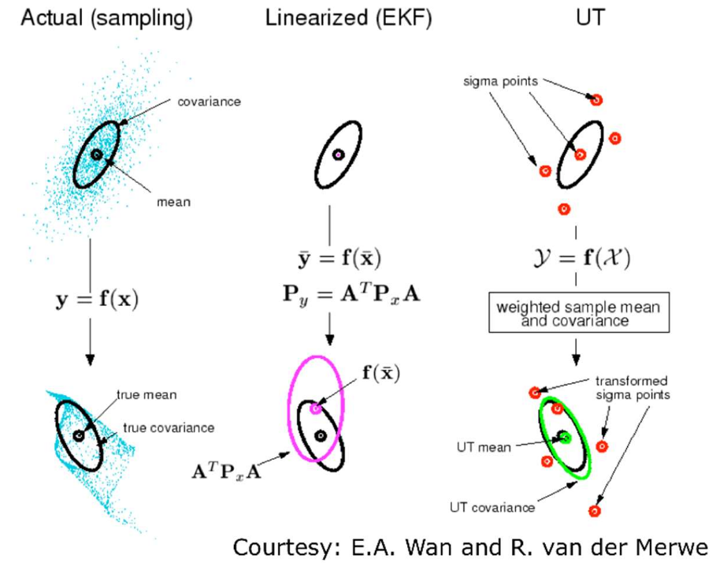

# Lecture 26, Mar 16, 2026

## Gaussian Filters -- Extended and Unscented Kalman Filtering

* Standard Kalman filter: assuming a linear model $\twopiece{\bm x_k = \bm A_{k - 1}\bm x_{k - 1} + \bm v_k + \bm w_k}{\bm y_k = \bm C_k\bm x_k + \bm n_k}$
	* Prediction step: $\twopiece{\check{\bm P}_k = \bm A_{k - 1}\hat{\bm P}_{k - 1}\bm A_{k - 1}^T + \bm Q_k}{\check{\bm x}_k = \bm A_{k - 1}\hat{\bm x}_{k - 1} + \bm v_k}$
	* Kalman gain: $\bm K_k = \check{\bm P}_k\bm C_k^T(\bm C_k\check{\bm P}_k\bm C_k^T + \bm R_k)^{-1}$
	* Corrections step: $\twopiece{\hat{\bm P}_k = (\bm 1 - \bm K_k\bm C_k)\check{\bm P}_k}{\hat{\bm x}_k = \check{\bm x}_k + \bm K_k(\bm y_K - \bm C_k\check{\bm x}_k)}$
	* Assuming modelling is correct, the Kalman filter is *consistent* (correct covariance) and *unbiased* (correct mean)

### Extended Kalman Filtering (EKF)

* Now we assume nonlinear models: $\twopiece{\bm x_k = \bm f(\bm x_{k - 1}, \bm v_k, \bm w_k)}{\bm y_k = \bm g(\bm x_k, \bm n_k)}$
* Derive the EKF from the Bayes filter: $\alignedeqn[t]{p(\bm x_k | \check{\bm x}_0, \bm v_{1:k}, \bm y_{0:k})}{\eta p(\bm y_k | \bm x_k)\int p(\bm x_k | \bm x_{k - 1}, \bm v_k)p(\bm x_{k - 1} | \check{\bm x}_0, \bm v_{1:k - 1}, \bm y_{0:k - 1})\,\dd\bm x_{k - 1}}$
	* First approximation: assume belief and noise are always Gaussian
		* $p(\bm x_k | \check{\bm x}_0, \bm v_{1:k}, \bm y_{0:k}) = \mathcal N(\hat{\bm x}_k, \hat{\bm P}_k)$
		* Assume $\bm w_k \sim \mathcal N(\bm 0, \bm Q_k), \bm n_k \sim \mathcal N(\bm 0, \bm R_k)$
	* Second approximation: linearize the motion and observation models
		* $\bm f(\bm x_{k - 1}, \bm v_k, \bm w_k) \approx \check{\bm x}_k + \bm F_{k - 1}(\bm x_{k - 1} - \hat{\bm x}_{k - 1}) + \bm w_k'$
			* $\bm F_{k - 1} = \pdiff{\bm f(\bm x_{k - 1}, \bm v_k, \bm w_k)}{\bm x_{k - 1}}$
		* $\bm g(\bm x_k, \bm n_k) \approx \check{\bm y}_k + \bm G_k(\bm x_k - \check{\bm x}_k) + \bm n_k'$
			* $\bm G_k = \pdiff{\bm g(\bm x_k, \bm n_k)}{\bm x_k}$
		* The predictions $\check{\bm x}_k, \check{\bm y}_k$ are calculated using the nonlinear model
		* Note $\bm w_k', \bm n_k'$ are not the same as the original noise terms if the noise affects the model in a nonlinear way; usually we just have an additive noise model however, so these would be the same
			* For non-additive noise, we transform the noise and noise covariance using the Jacobians $\pdiff{\bm f(\bm x_{k - 1}, \bm v_k, \bm w_k)}{\bm w_k}$ and $\pdiff{\bm g(\bm x_k, \bm n_k)}{\bm n_k}$
	* Taking expectations, $\twopiece{p(\bm x_k | \bm x_{k - 1}, \bm v_k) = \mathcal N(\check{\bm x}_k + \bm F_{k - 1}(\bm x_{k - 1} - \hat{\bm x}_{k - 1}), \bm Q_k')}{p(\bm y_k | \bm x_k) \approx \mathcal N(\check{\bm y}_k + \bm G_k(\bm x_k - \check{\bm x}_k), \bm R_k')}$
	* Now we substitute the approximated PDFs into the Bayes filter equation, and use the direct product and Gaussian inference identities
	* We have the new distribution $\mathcal N(\check{\bm x}_k + \bm K_k(\bm y_K - \check{\bm y}_k), (\bm 1 - \bm K_k\bm G_k)(\bm F_{k - 1}\hat{\bm P}_{k - 1}\bm F_{k - 1}^T + \bm Q_k'))$ where the Kalman gain is $\bm K_k = \check{\bm P}_k\bm G_k^T(\bm G_k\check{\bm P}_k\bm G_k^T + \bm R_k')^{-1}$
* EKFs only work well for mildly nonlinear non-Gaussian systems, as our approximation breaks down if the model deviates too much
	* Our linearization point is about the estimate instead of the true state, so as the system becomes more uncertain the approximation gets worse
	* The distribution also becomes less and less Gaussian as we pass it through the nonlinearity
	* Therefore the EKF can be biased and inconsistent and lead to divergence
	* The Jacobian is a first-order approximation; we need a better way to transform PDFs through nonlinearities

### Unscented Kalman Filtering (UKF)

* The *unscented* or *sigma point* transformation transforms PDFs by drawing a small number of deterministic and representative samples, transforming them with the nonlinearity, and using the result to reconstruct the output PDF
	1. Compute a set of $2L + 1$ *sigma points*, where $L$ is the dimensionality of the state
		* Take the Cholesky decomposition: $\bm L\bm L^T = \bm\Sigma _x$
		* The first point is the mean $\bm x_0 = \bm\mu _x$
		* For other samples, $\twopiece{\bm x_i = \bm\mu _x + \sqrt{L + \kappa}\on{col}_i\bm L}{\bm x_{i + L} = \bm\mu _x - \sqrt{L + \kappa}\on{col}_i\bm L}$
			* $\kappa$ is a parameter we control; the larger it is, the more spread out the samples are
			* There is a particular $\kappa$ which minimizes error for Gaussians
		* We essentially take samples in all directions of the mean, one for each dimension
	2. Pass each through the nonlinearity: $\bm y_i = \bm g(\bm x_i)$
	3. Compute the output PDF:
		* $\bm\mu _y = \sum _{i = 0}^{2L} \alpha _i\bm y_i$ with weight $\alpha _i = \twocond{\frac{\kappa}{L + \kappa}}{i = 0}{\frac{1}{2}\frac{1}{L + \kappa}}{\text{otherwise}}$
		* $\bm\Sigma _{yy} = \sum _{i = 0}^{2L} \alpha _i(\bm y_i - \bm\mu _y)(\bm y_i - \bm\mu _y)^T$
		* Then we approximate the output density as a Gaussian with this mean and covariance
* The *unscented Kalman filter* (UKF) uses the transform:
	* Prediction step:
		1. Stack the prior belief and motion noise as $\bm\mu _z = \cvec{\hat{\bm x}_{k - 1}}{\bm 0}, \bm\Sigma _{zz} = \mattwo{\hat{\bm P}_{k - 1}}{\bm 0}{\bm 0}{\bm Q_k}$
		2. Sample sigma points
		3. Extract state and motion noise for each sigma point as $\bm z_i = \cvec{\hat{\bm x}_{k - 1, i}}{\bm w_{k, i}}$, and pass through nonlinear motion model
		4. Compute new predicted mean and covariance from sigma points to get $\check{\bm x}_k, \check{\bm P}_k$
	* Correction step:
		1. Stack prediction belief and observation noise as $\bm\mu _z = \cvec{\check{\bm x}_k}{\bm 0}, \bm\Sigma _{zz} = \mattwo{\check{\bm P}_k}{\bm 0}{\bm 0}{\bm R_k}$
		2. Sample sigma points
		3. Extract state and measurement noise for each sigma point as $\bm z_i = \cvec{\check{\bm x}_{k,i}}{\bm n_{k,i}}$ and pass through nonlinear measurement model
		5. Compute new predicted mean and covariance, $\bm\Sigma _{yy,k}$ and $\bm\Sigma _{xy,k}$ (computed using $\check{\bm x}_{k,i}$ and $\check{\bm y}_{k, i}$)
		6. Update: $\threepiece{\bm K_k = \bm\Sigma _{xy,k}\bm\Sigma _{yy,k}^{-1}}{\hat{\bm P}_k = \check{\bm P}_k - \bm K_k\bm\Sigma _{xy,k}^T}{\hat{\bm x}_k = \check{\bm x}_k + \bm K_k(\bm y_k - \bm\mu _{y,k})}$
* The UKF still assumes Gaussian beliefs, but the linearization considers a much larger area and captures the resulting distribution much better
	* The unscented transform is a third-order approximation compared to the first-order approximation of EKF Jacobians
	* The UKF also does not need Jacobians to be explicitly computed
	* The parameter $\kappa$ can be tweaked to work better with the specific nonlinearity

{width=60%}

