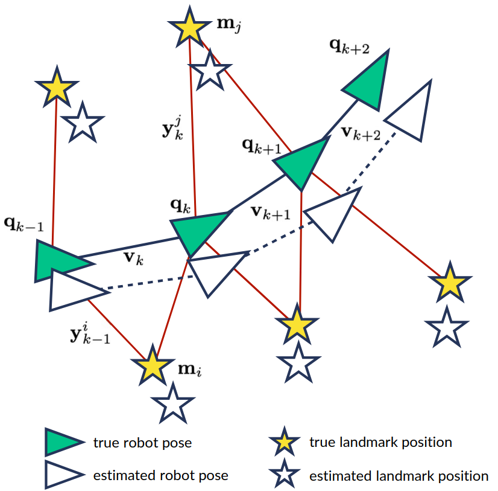
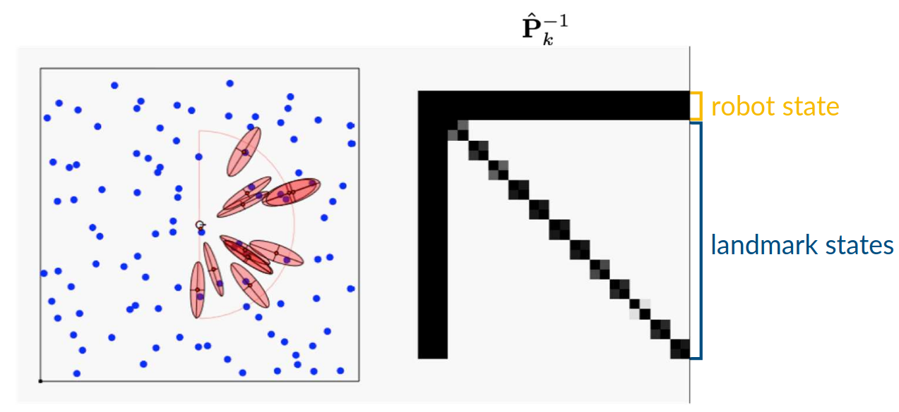

# Lecture 27, Mar 16, 2026

## Filter-Based SLAM

* Consider the problem of a moving robot, generating a series of frames; we have the frame-to-frame odometric measurements, measurements of landmarks; we need to compute ta globally consistent map of landmarks in the inertial frame, and localize our robot

{width=50%}

### EKF-SLAM

* We augmented the state $\bm x_k$ to contain both the robot pose and the pose of all landmarks
	* e.g. in 2D the augmented state contains the 3 dimensions of robot position and heading, and 2 dimensions per landmark for its coordinates
* The motion model is augmented to account for the landmarks, which don't move so they simply have an identity motion model, and no process noise
* The resulting covariance matrix has diagonal blocks for the robot's state uncertainty, the landmark position uncertainties, and the off-diagonal terms relating them
	* The landmark position uncertainties are all correlated, so upon loop closure we see all their uncertainties shrink
	* Without loop closure, we have the typical growing uncertainty in both robot and landmark position from odometry
* Some important results related to EKF-SLAM:
	* The determinant of any sub-matrix of the map covariance matrix decreases monotonically as observations are made
		* i.e. each individual landmark uncertainty doesn't grow, since there is no process noise
	* In the limit with an infinite number of measurements, the landmark estimates become fully correlated
* EKF-SLAM suffers from the curse of dimensionality; inverting the matrix to compute the Kalman gain requires inverting a dense $(2N + 3) \times (2N + 3)$ matrix (for the 2D case) for $N$ landmarks
	* This means it's impractical to use online beyond a few hundred landmarks
	* We can use submapping to address this, i.e. break down the map into smaller sub-maps, e.g. for rooms
	* The formulation can be changed to use the inverse covariance matrix (i.e. an *information filter*), which has a sparse structure for a single timestep (i.e. before the robot starts to move)
		* Once the robot moves however, correlations between landmarks observed in successive steps slowly fill in the inverse covariance
		* This leads to the *sparse extended information filter* (SEIF) approximation, which ignores the nearly zero entries

{width=70%}

* The information filter tracks $\bm P_k^{-1}$ instead:
	* Prediction: $\twopiece{\check{\bm x}_k = \bm A_{k - 1}\hat{\bm x}_{k - 1} + \bm v_k}{\check{\bm P}_k = \bm Q_k + \bm A_{k - 1}\hat{\bm P}_{k - 1}\bm A_{k - 1}^T}$
	* Correction: $\twopiece{\hat{\bm P}_k^{-1} = \check{\bm P}_k^{-1} + \bm C_k^T\bm R_k^{-1}\bm C_k}{\hat{\bm P}_k^{-1}\hat{\bm x}_k = \check{\bm P}_k^{-1}\check{\bm x}_k + \bm C_k^T\bm R_k^{-1}\bm y_k}$
* EKF can be swapped out for UKF, which has the same computational constraints

### FastSLAM

* We factor the belief as $p(\bm x_{1:K}, \bm m | \bm y_{1:K}, \bm u_{1:K}) = p(\bm m | \bm x_{1:K}, \bm y_{1:K})p(\bm x_{1:K} | \bm y_{1:K}, \bm u_{1:K})$
* In the *Rao-Blackwellized particle filter* (RBPF), we use particles for some dimensions (i.e. the poses) and marginalize out the rest (i.e. the map), which is represented using something else
	* Without this, particle filtering for SLAM would be impractical since we have an extremely high dimensional state space
	* For point landmarks, $p(\bm x_{1:K}, \bm l_{1:L} | \bm y_{1:K}, \bm u_{1:K}) = p(\bm x_{1:K} | \bm y_{1:K}, \bm u_{1:K})\prod _{l = 1}^L p(\bm l_l | \bm x_{1:K}, \bm y_{1:K})$ where $\bm l$ are landmarks
		* The first factor will be represented using particles, while the second factor is represented using a low-dimensional Gaussian (EKF) or occupancy grid, etc
		* This means that each particle would have its own version of the map, which is built assuming a known trajectory
		* Since the second term is factored into a product, this is more scalable than EKF-SLAM
* In each iteration we weight particles by comparing actual measurements with predicted measurements for each particle, using its map
* Upon loop closure the particle with the map which best explains the measurements is sampled more, and the inconsistent maps drop out
	* This means that instead of an explicit correction upon loop closure, we rely upon the assumption that we'll always have at least one particle which has a good map

