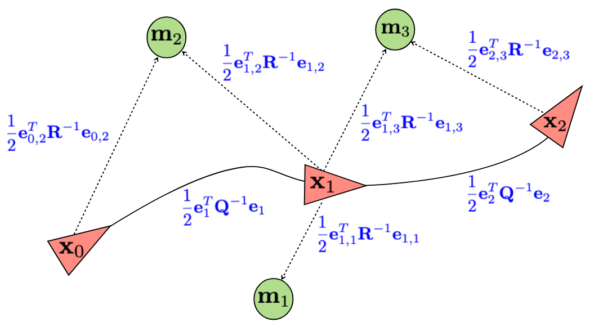
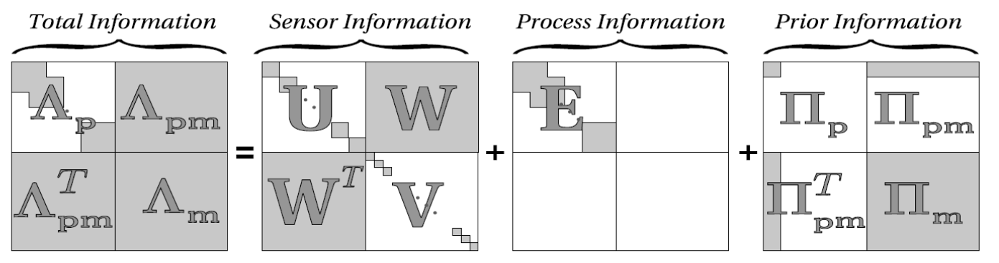
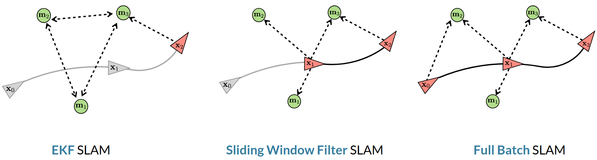

# Lecture 28, Mar 18, 2026

## Batch SLAM

* Filtering-based SLAM keeps only the most recent pose, leading to issues over long-term
	* Filters lock in their decisions; since we don't do global optimization, new information doesn't always allow us to correct for earlier mistakes, e.g. large loop closures
		* EKF-SLAM needs uncertainties to be kept perfects to backpropagate the loop closure uncertainty
		* Particle filters need lots of particles to keep track of the growing uncertainty and map distribution
	* By marginalizing out previous states (i.e. removing $\bm x_{k - 1}$), EKF-SLAM destroys the sparse arrowhead structure of the information matrix as all landmark poses start being correlated
* In batch SLAM, we keep previous poses around and perform global optimization upon loop closure, similar to bundle adjustment
	* We build a graph using odometry measurements and landmark observations, with nodes representing poses/landmarks and edges representing measurements
	* The SLAM problem reduces to finding the configuration of the poses that minimizes a cost
	* Analogous to a network of springs where the stiffness of each spring is the confidence of the measurement, and finding the minimum energy configuration
* Consider landmarks with location $\bm m = \cvec{x}{y}$, initial pose $\bm x_0 = \bm 0$, with odometry measurements $\bm u = \cvec{u}{\omega}$ and landmark measurements $\bm y = \cvec{r}{\phi}$; we want to find robot poses $\bm x = \cvec{x}{y}{\theta}$
	* The full state consists of stacking all the poses and landmark locations into $\bm z = \rvec{\bm x_1}{\cdots}{\bm x_k}{\bm m_{1,1}}{\cdots}{\bm m_{k,l}}^T$
	* Consider a motion model $\bm x_k = \bm f(\bm x_{k - 1}, \bm u_k, \bm w_k), \bm w_k \sim \mathcal(\bm 0, \bm Q)$ and an observation model $\bm y_{kl} = \bm g(\bm x_k, \bm m_l, \bm n_k), \bm n_k \sim \mathcal N(\bm 0, \bm R)$
		* Often we use a unicycle model and a range and bearing to landmarks:
		* $\bm x_k = \bm x_{k - 1} + T\matthreetwo{\cos\theta _{k - 1}}{0}{\sin\theta_{k - 1}}{0}{0}{1}\bm u_k + \bm w_k$
		* $\bm y_{kl} = \cvec{\norm{\bm x_l - \bm x_k}}{\atantwo(y_l - y_k, x_l - x_k)} + \bm n_k$
	* We form a motion model error $\bm e_k = \bm x_k - \bm f(\bm x_{k - 1}, \bm u_k, \bm 0) \sim \mathcal N(\bm 0, \bm Q)$ and observation model error $\bm e_{kl} = \bm y_{kl} - \bm g(\bm x_k, \bm m_l, \bm 0) \sim \mathcal N(\bm 0, \bm R)$
	* Define a quadratic loss: $J = \frac{1}{2}\sum _{k = 1}^K \bm e_k^T\bm Q^{-1}\bm e_k + \frac{1}{2}\sum _{k - 1}^K\sum _{l = 1}^L \bm e_{kl}^T\bm R^{-1}\bm e_{kl}$
		* This is equivalent to finding the $\bm z$ that maximizes the likelihood of the measurements, assuming independence of measurements with each other and inputs, and using Gaussians

{width=60%}

* To optimize the cost, we linearize the cost for a small step $\delta\bm x$, find the optimal step, and repeat
	* $\alignedeqntwo[t]{\bm e_k}{\bm x_k - \bm f(\bm x_{k - 1}, \bm u_k, \bm 0) = \bar{\bm x}_k + \delta\bm x_k - \bm f(\bar{\bm x}_{k - 1} + \delta\bm x_{k - 1}, \bm u_k, \bm 0)}{\bar{\bm x}_k - \bm f(\bar{\bm x}_{k - 1} + \delta\bm x_{k - 1}, \bm u_k, \bm 0) + \delta\bm x_k - \pdiff{\bm f}{\bm x}\delta\bm x_{k - 1}}{\bar{\bm e}_k + \delta\bm x_k - \bm F_{k - 1}\delta\bm x_{k - 1}}$
	* $\alignedeqntwo[t]{\bm e_{kl}}{\bm y_k - \bm g(\bm x_k, \bm m_l,\bm 0)}{\bm y_k - \bm g(\bar{\bm x}_k + \delta\bm x_k, \bar{\bm m}_l + \delta\bm m_l, \bm 0)}{\bar{\bm y}_k - \bm g(\bar{\bm x}_k, \bar{\bm m}_l, \bm 0) - \pdiff{\bm g}{\bm x}\delta\bm x_k - \pdiff{\bm g}{\bm m}\bm m_l}{\bar{\bm e}_{kl} - \bm G_{x,kl}\delta\bm x_k - \bm G_{m,kl}\delta\bm m_l}$
	* Perturbed cost: $\alignedeqntwo[t]{J}{\alignedlines[t]{}{\frac{1}{2}\sum _{k = 1}^K \left(\bar{\bm e}_k + \delta\bm x_k - \bm F_{k - 1}\delta\bm x_{k - 1}\right)^T\bm Q^{-1}\left(\bar{\bm e}_k + \delta\bm x_k - \bm F_{k - 1}\delta\bm x_{k - 1}\right)}{+ \frac{1}{2}\sum _{k - 1}^K\sum _{l = 1}^L \left(\bar{\bm e}_{kl} - \bm G_{x,kl}\delta\bm x_k - \bm G_{m,kl}\delta\bm m_l\right)^T\bm R^{-1}\left(\bar{\bm e}_{kl} - \bm G_{x,kl}\delta\bm x_k - \bm G_{m,kl}\delta\bm m_l\right)}}{\frac{1}{2}(\bar{\bm e} + \bm E\delta\bm z)^T\bm T^{-1}(\bar{\bm e} + \bm E\delta\bm z)}$
		* Here $\bm T$ is a large block diagonal matrix with the individual covariance matrices $\bm Q, \bm R$ repeated as many times as necessary along the diagonal
	* To get the optimal update we solve $\bm E^T\bm T^{-1}\bm E\delta\bm z^* = -\bm E^T\bm T^{-1}\bar{\bm e}$; starting with an initial guess (odometry and first observed landmark locations), we solve for $\delta\bm z^*$ and update $\bar{\bm z} \gets \bar{\bm z} + \delta\bm z^*$ and iterate until $\delta\bm z^*$ is sufficiently small
	* Since this method assumes locally quadratic costs, in practice we use the following techniques to improve robustness:
		1. *Levenberg-Marquardt* iteration: $(\bm E^T\bm T^{-1}\bm E\delta + \mu\diag(\bm E^T\bm T^{-1}\bm E\delta))\bm z^* = -\bm E^T\bm T^{-1}\bar{\bm e}$ where $\mu$ is a tunable parameter and $\diag(\bm A)$ means a diagonal matrix obtained by setting al off-diagonal terms of $\bm A$ to 0
		2. Line search: After obtaining $\delta\bm z^*$, do a line search along its direction to make sure we don't go too far; do $\bar{\bm z} \gets \bar{\bm z} + \alpha\delta\bm z$ where we pick the largest $\alpha \in [0, 1]$ that still decreases $J$
	* $\bm A = \bm E^T\bm T^{-1}\bm E$ is the precision or inverse covariance of the final estimate of $\bar{\bm z}$; it is sparse with an arrowhead structure, so the Schur complement can be used for inversion

{width=100%}

{width=100%}

* Running batch SLAM online requires changes to limit the growth of the problem
	* The sliding window filter marginalizes out old poses and invisible landmarks beyond the sliding window, but keeps poses within the window
		* This is similar to a hybrid between EKF-SLAM/filtering based methods and batch SLAM
		* However loop closure is still a problem
	* The adaptive relative bundle adjustment approach applies optimization to a local window of active landmarks and poses, without making a consistent global map
		* Use coordinates relative to the current pose instead of global poses, so we can do locally consistent optimization
		* The size of the active window adapts based on which poses have seen the current landmarks and agreement between poses and landmarks
		* Old poses can still be activated to perform a loop closure		

