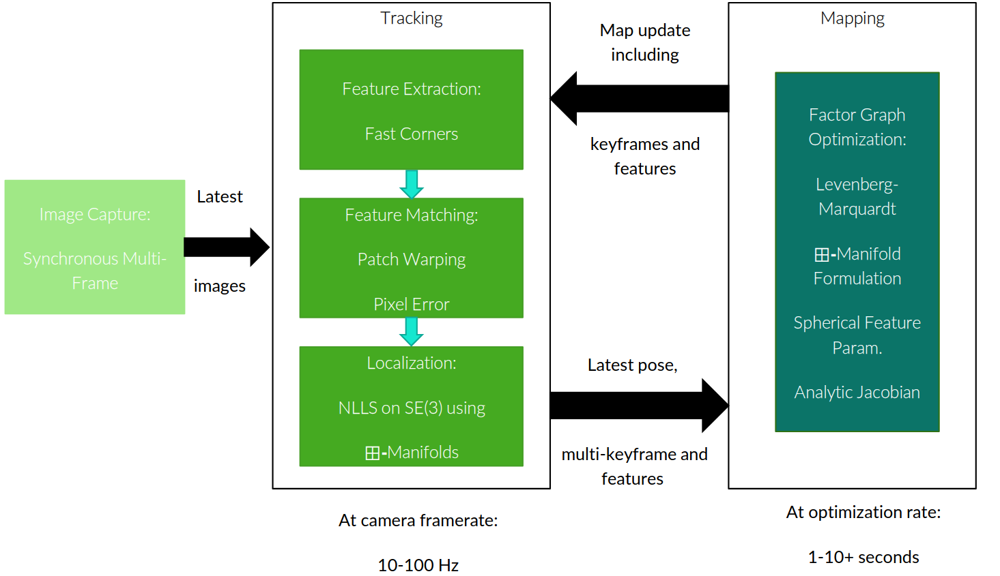
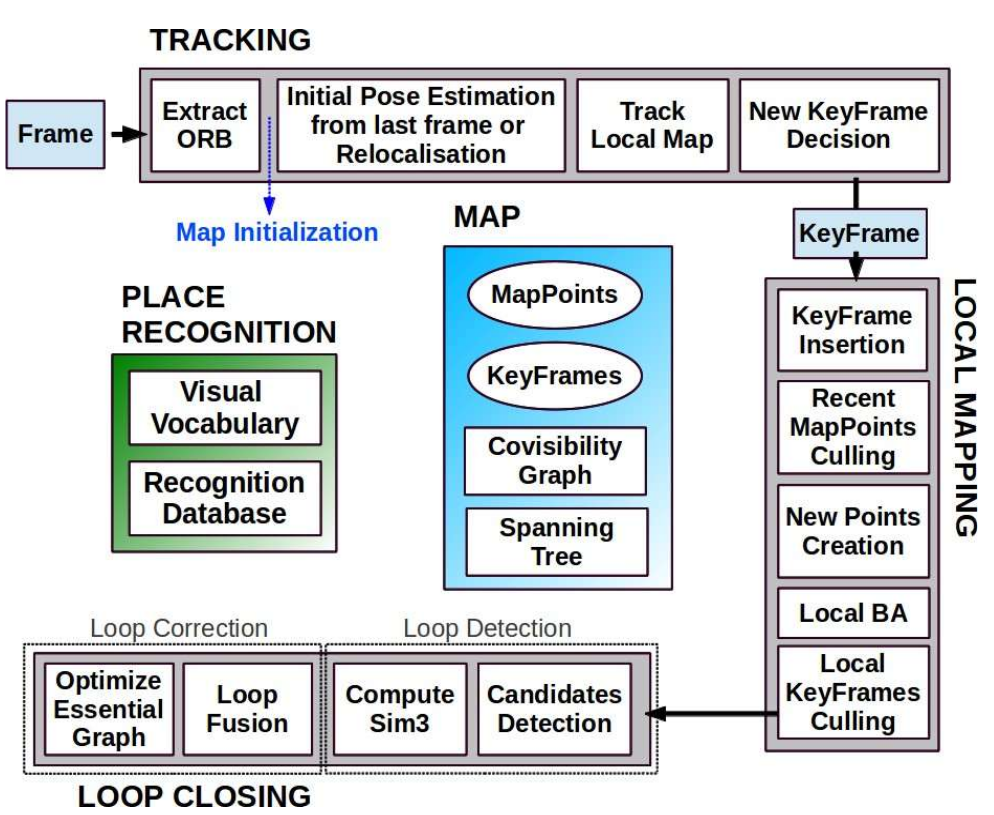

# Lecture 29, Mar 23, 2026

## Visual SLAM Methods

### Feature-Based SLAM

* Most visual SLAM methods have a structure consisting of a frontend which extracts features and performs data association (feature tracking and loop closure), which feeds into a backend that optimizes the map
* MonoSLAM (2007) was the first real-time monocular SLAM method
	* Uses Shi-Tomasi features and constant velocity motion models
	* Builds a probabilistic feature map using bundle adjustment for each frame
* PTAM (2007) separates tracking (localization against existing point cloud) and mapping into separate parallel threads
	* Tracking uses coarse-to-fine feature matching to estimate pose and then local bundle adjustment over a small number of frames
	* Initialization of scale uses two frames to perform stereo matching
* Multi-Camera PTAM (MCPTAM) extends PTAM to simultaneous mapping with multiple cameras with non-overlapping FOVs
	* Uses spherical coordinates to parametrize features, so uncertainty in depth is focused in a single dimension, instead of spread out over all 3 in Cartesian
	* Inverse depth instead of normal depth to improve optimization (preserves linearity better)
* All these systems only retain information from specific keyframes, often based on distance travelled and a feature overlap constraint
	* MCPTAM's keyframe selection uses the amount of reduction in covariance of features, assuming camera pose is known; this calculation is done similarly to that of a Kalman filter
		* The keyframe which maximizes the total sum of point entropy reduction is used

{width=80%}

* ORB-SLAM is considered a benchmark system, using ORB features and a monocular camera to track position
	* Incorporates 3 key ideas on top of PTAM:
		* Scale drift-aware loop closure: optimizing over the scale parameter and allowing it to vary when matching features
		* Covisibility graph: keep track of the viewpoint at which each feature is observed, and when matching use viewpoints to filter out implausible features
		* Bag of binary words (DBoW): extract a descriptor for each keyframe and use it to identify loop closures
			* Bag of words builds the vocabulary by collecting a large number of images, extracting features in all the images, and then clustering all the features; each cluster becomes a word, and an image's BoW descriptor consists of whether it contains a feature in each cluster
			* Perceptual aliasing is a potential issue
	* Parallel thread architecture consisting of tracking (localization against existing map), local mapping (local bundle adjustment), and loop closure (detecting large loop closures and pose graph optimization, then full bundle adjustment)
	* ORB feature extraction uses a grid to ensure a more even distribution
	* Lots of keyframes are added using a set of different conditions, and keyframes are culled if 90% of its points are visible in at least 3 other keyframes
	* Feature matching uses a series of conditions to filter, including field of view, viewing angle to feature, and range of scale
	* If lost, ORB-SLAM performs global relocalization by converting the current frame into a bag of words, querying a database to get matching keyframes, then localizing against these
	* Loop closure starts with an "essential graph" derived from a minimum spanning tree to get an initial solution, then global bundle adjustment to get an accurate solution
	* ORB-SLAM2 extends ORB-SLAM to stereo and RGB-D, including semi-dense and dense mapping; ORB-SLAM3 introduces map atlases for large scale mapping

{width=60%}

### Direct SLAM

* Direct SLAM methods directly match pixel intensity values instead of feature matching; the frame-to-frame transform is used to warp one image into another's viewpoint, then the photometric error is minimized
* As before, the tracking and mapping (including depth estimation) threads are separated
* LSD-SLAM is considered a seminal work in direct SLAM
* In general, direct methods are more computationally intensive but creates denser maps, and uses more information in the environment
	* Direct methods struggle to model geometric noise such as rolling shutter without full photometric calibration
	* Good initialization is needed, usually using an IMU
* Direct sparse odometry (DSO) speeds up the process by limiting the number of pixels tracked and incorporates photometric calibration
	* Using a window of 7 keyframes, and fixed number of 2000 active points
	* Pixel selection is done using a region-adaptive gradient threshold and try to maintain a uniform distribution

