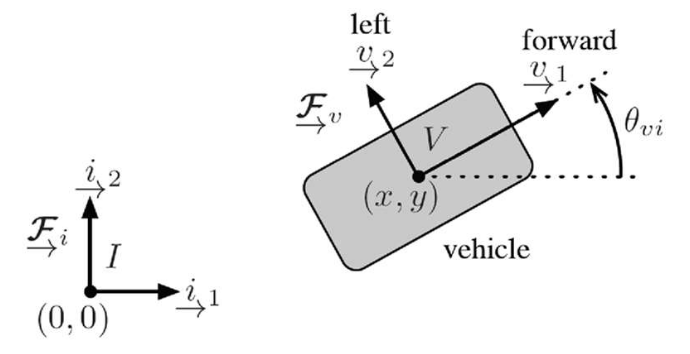

# Lecture 3, Jan 7, 2026

## Mathematical Background

* There is no representation of rotations that has exactly 3 parameters (and therefore no constraints) and is also free of singularities
* Rotation representations include axis-angle (4 parameters including a unit length $\bm a$ and angle $\phi$), quaternions (4 parameters subject to unit length), and Gibbs vector $\bm g = \bm a\tan\frac{\phi}{2}$ (3 parameters but singularity at $\phi = \pi$)
	* $\bm\varepsilon = \bm a\sin\frac{\phi}{2}, \eta = \cos\frac{\phi}{2}$ to convert between axis angle and quaternions
* For small perturbations, we have approximately $\bm C = 1 - \bm\theta^\times$ where $\bm\theta = \phi\bm a$
	* In this case the product of the principal rotations (Euler angles) is approximately their sum
	* This is used a lot in optimization
* Time derivatives of vectors seen in different frames is related as $\uvec r^\dota = \uvec r^\dotb + \uvec\omega _{21} \times \uvec r$
	* In terms of coordinates, $\bm C_{12}(\dot{\bm r}_2 + {\bm\omega _2^{21}}^\times\bm r_2)$
	* We often have $\uvec r$ denoting some position, $\vcx F_1$ being an inertial frame and $\vcx F_2$ being a moving frame (e.g. vehicle frame)
* We can show that the rotation matrix obeys Possion's equation: $\dot{\bm C}_{21} = -{\bm\omega _2^{21}}^\times\bm C_{21}$
	* This means we can obtain the rotation matrix in a navigation scenario by integrating the equation, with $\bm\omega$ obtained from a sensor attached to the vehicle
* Consider a point $P$, which is $\uvec r^{pi}$ in frame $i$ and $\uvec r^{pv}$ in frame $v$; given the pose of frame $v$, $\set{\bm r_i^{vi}, \bm C_{iv}}$, the vectors can be related as $\bm r_i^{pi} = \bm C_{iv}\bm r_v^{pv} + \bm r_i^{vi}$
	* $\bm r_a^{bc}$ denotes the coordinates of the vector from $c$ to $b$, expressed in frame $a$
	* Notice that the indices of the translation $\bm r_i^{vi}$ look reversed, since we need to add the coordinates of frame $v$ relative to frame $i$ to get from $v$ to $i$
* As a homogeneous transformation, $\cvec{\bm r_i^{pi}}{1} = \mattwo{\bm C_{iv}}{\bm r_i^{vi}}{\bm 0^T}{1}\cvec{\bm r_v^{pv}}{1} = \bm T_{iv}\cvec{\bm r_v^{pv}}{1}$
	* Note $\bm T_{iv}^{-1} = \mattwo{\bm C_{iv}}{\bm r_i^{vi}}{\bm 0^T}{1}^{-1} = \mattwo{\bm C_{iv}^T}{-\bm C_{iv}^T\bm r_i^{vi}}{\bm 0^T}{1} = \mattwo{\bm C_{vi}}{-\bm r_v^{vi}}{\bm 0^T}{1} = \mattwo{\bm C_{vi}}{\bm r_v^{iv}}{\bm 0^T}{1} = \bm T_{vi}$
* The generalization of angular velocity for poses is $\bm\varpi _v^{vi} = \cvec{\bm\nu ^{vi}}{\bm\omega _v^{vi}}$, consisting of the linear and angular velocities
	* $\dot{\bm T}_{vi} = \mattwo{{\bm\omega _v^{vi}}^\times}{-\bm\nu _v^{vi}}{\bm 0^T}{0}\bm T_{vi}$

{width=50%}

* Example: we can derive the unicycle model by considering a 2D robot with position $(x, y)$ and angle $\theta _{vi}$, where axis $z$ comes out of the plane
	* $\bm r_i^{vi} = \cvec{x}{y}{0}, \bm C_{vi} = \bm C_3(\theta _{vi}) = \matthree{\cos\theta _{vi}}{\sin\theta _{vi}}{0}{-\sin\theta _{vi}}{\cos\theta _{vi}}{0}{0}{0}{1}$
		* Note the notation for elementary rotations is different; $\bm C_3(\theta)$ does not denote a rotational transformation by $\theta$, rather it denotes the transformation from the current frame to a frame obtained by rotating by $\theta$, so the formula for the rotation matrices is transposed compared to the usual ones
	* For the pose we want $\bm T_{iv} = \mattwo{\bm C_{iv}}{\bm r_i^{vi}}{\bm 0^T}{1} = \matfour{\cos\theta _{vi}}{-\sin\theta _{vi}}{0}{x}{\sin\theta _{vi}}{\cos\theta _{vi}}{0}{y}{0}{0}{1}{0}{0}{0}{0}{1}$
		* Note this is not $\bm T_{vi}$, so we use $\bm C_{iv}$ and not $\bm C_{vi}$!
		* Usually the third row and column is omitted for 2D
	* For kinematics we constrain $\bm\varpi _v^{vi} = \rvec{v}{0}{0}{0}{0}{\omega}^T$, i.e. only forward movement and rotation along $z$
	* Using the relation between $\dot{\bm T}_{iv}$ and $\bm\varpi _v^{vi}$ we get $\threepiece{\dot x = v\cos\theta}{\dot y = v\sin\theta}{\dot\theta = \omega}$

