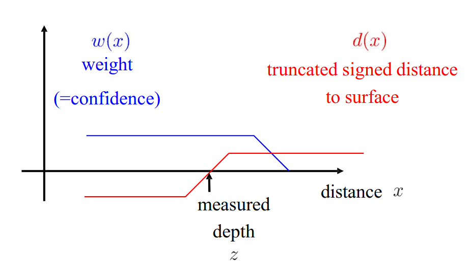

# Lecture 30, Mar 23, 2026

## LiDAR and RGB-D SLAM

* LiDAR odometry and mapping (LOAM) uses a feature extractor and considers keypoints in the point cloud only
	* Keypoint selection looks for planes and edges, but avoids oblique planes and edges caused by occlusion (which may change based on viewpoint)
	* Pipeline consists of using LiDAR frame point cloud registration for odometry, local scan aggregation and mapping
* Visual LOAM (VLOAM, 2016) fuses a vision input, in addition to LiDAR and IMU
	* IMU is used to propagate the pose prediction, then used in a visual-inertial odometry pipeline using feature matching to refine the pose estimate; finally, a LOAM-like feature registration approach is used for scan matching refinement
* Other LiDAR-camera-inertial approaches:
	* LiDAR-enhanced visual SLAM: solving bundle adjustment, using LiDAR depth to initialize feature depths
	* Vision-enhanced LiDAR SLAM (V-LOAM): pose graph optimization and scan registration with poses initialized with visual SLAM outputs
	* Tightly coupled (LVI-SLAM): optimize LiDAR and camera measurements simultaneously through bundle adjustment and pose graphs
* LIO-SAM (2020) is an example of a modern LiDAR SLAM system
* *Signed distance fields* represents surfaces implicitly by storing the distance to the nearest surface in each cell (negative distances for cells inside the object)
	* The max distance is usually truncated (i.e. capped to a maximum magnitude)
	* The actual surface can be extracted by interpolating the zero crossings of the SDF using marching cubes
		* The zero crossing can be extracted at sub-voxel accuracy, so reconstructions can get much more accurate
	* For fusing multiple measurements, we can weight observations in a way similar to LiDAR or sonar
	* Over time, noise cancels out since the depth averages to the correct depth

{width=50%}

* Dense Tracking and Mapping (DTAM) builds a TSDF using keyframes with monocular vision, with a frustum like grid model which expands with distance from the camera
	* Builds detailed dense maps
	* Suffers from lighting changes, and takes a lot of views to be accurate
	* Need to initialize with a feature-based method until the keyframe is built
	* Textureless regions don't perform well since there is no explicit depth measurement
* KinectFusion is one of the first methods to use RGB-D input, from a Kinect sensor, using a TSDF and ICP registration odometry (no loop closure)
	* Used a fixed volume and relied on slower camera movements
* Kintinuous extended KinectFusion to much larger maps and introduces loop closures
	* The KinectFusion core is used to build smaller submaps, which are loaded on the fly
	* Loop closures are detected using place recognition
	* Each submap had a pose associated, and on loop closure the submap pose is updated as needed
* ElasticFusion solved the problem of deforming the map on loop closure, by storing the environment using surfels
	* Each surfel has a position, normal, radius, colour and confidence
	* The surfel map is reduced to a polygonal mesh, which can be distorted as needed for loop closure, and then surfel positions are interpolated
* Recently neural radiance fields (NeRFs) have emerged as an alternative implicit representation of the scene, storing all properties of the scene inside a neural network
	* This often sacrifices some geometric accuracy but allows rendering views from any angle
	* NICE-SLAM (2022) does SLAM using NeRFs in real time
	* iSDF (2022) uses SDFs but stored implicitly in a neural network

