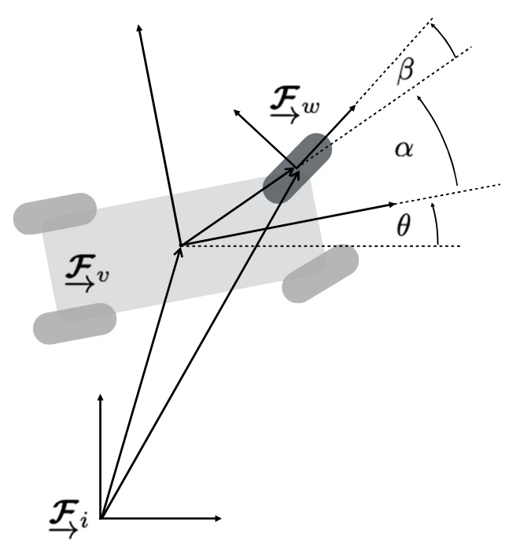
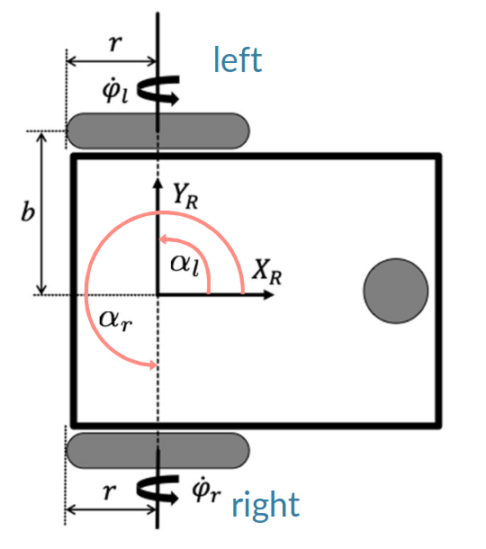
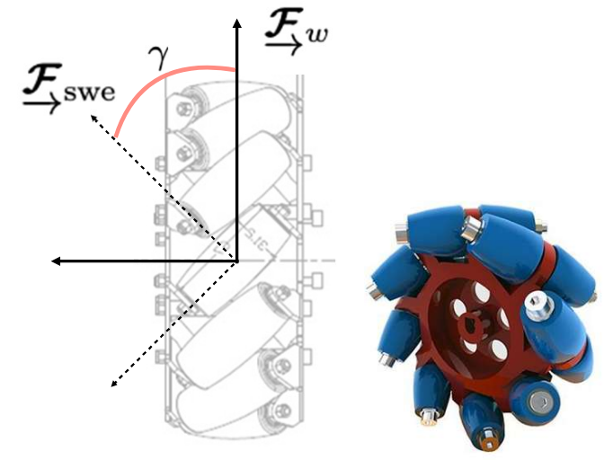
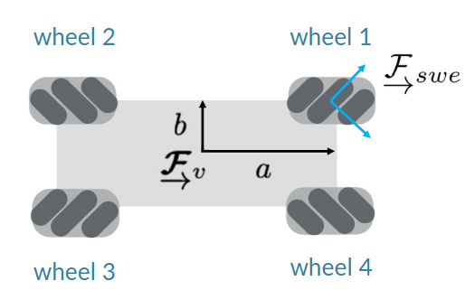
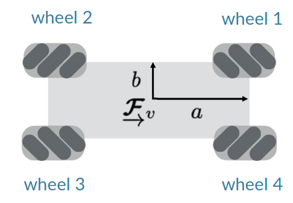

# Lecture 4, Jan 12, 2026

## Wheel Differential Kinematics

* For the standard wheel, we assume rolling without slipping, so $v_x = \dot\varphi r$ and $v_y, v_z = 0$

{width=30%}

* Consider a vehicle with heading $\theta$, with a wheel at angle $\alpha$ and distance $\norm{\uvec r^{wv}} = d$ relative to vehicle frame, with steering angle $\beta$
	* $\uvec r^{wi} = \uvec r^{vi} + \uvec r^{wv} \implies \bm v_w^{wi} = \bm v_w^{vi} + {\bm\omega _w^{vi}}^\times\bm r_w^{wv}$ in the wheel frame
	* This becomes $\cvec{\dot\varphi r}{0}{0} = \bm C_3(\alpha + \beta)\bm v_v^{vi} + \cvec{0}{0}{\dot\theta}^\times\cvec{d\cos\beta}{-d\sin\beta}{0}$
	* Simplify: $\cvec{\dot\varphi r}{0}{0} = \matthreeb{\cos(\alpha + \beta)}{\sin(\alpha + \beta)}{0}{-\sin(\alpha + \beta)}{\cos(\alpha + \beta)}{0}{0}{0}{1}\bm v_v^{vi} + \cvec{d\sin\beta}{d\cos\beta}{0}\dot\theta$
		* The 3 equations express the rolling without sliding, no sideways sliding, and contact with ground constraints
	* Let $\dot{\bm q} = \cvec{\dot x}{\dot y}{\dot\theta}$ be the pose rate in inertial frame, so in vehicle frame $\dot{\bm\xi} = \cvec{v}{u}{\omega} = \bm C_3(\theta)\dot{\bm q}$ (where $\omega = \dot\theta$)
		* $\rvec{\cos(\alpha + \beta)}{\sin(\alpha + \beta)}{d\sin\beta}\dot{\bm\xi} = \dot\varphi r$
		* $\rvec{-\sin(\alpha + \beta)}{\cos(\alpha + \beta)}{d\cos\beta}\dot{\bm\xi} = 0$

{width=35%}

* Example: differential drive model
	* $\mat{\mrow{\cos(\alpha _r + \beta _r)}{\sin(\alpha _r + \beta _r)}{d_r\sin\beta _r}\mrow{\cos(\alpha _l + \beta _l)}{\sin(\alpha _l + \beta _l)}{d_l\sin\beta _l}\mrow{-\sin(\alpha _r + \beta _r)}{\cos(\alpha _r + \beta _r)}{d_r\cos\beta _r}\mrow{-\sin(\alpha _l + \beta _l)}{\cos(\alpha _l + \beta _l)}{d_l\cos\beta _l}}\cvec{v}{u}{\omega} = \cvec{\dot\varphi _rr}{\dot\varphi _lr}{0}{0}$
	* Substituting and simplifying: $\mat{\mrow{1}{0}{b}\mrow{1}{0}{-b}\mrow{0}{1}{0}\mrow{0}{1}{0}}\cvec{v}{u}{\omega} = \cvec{\dot\varphi _rr}{\dot\varphi _lr}{0}{0}$
		* These are known as the *differential kinematics* of the robot, relating the body-centric velocity to the wheel speeds
		* e.g. If $\dot\varphi _r = \dot\varphi _l$, we get $\omega = 0$ which intuitively makes sense
	* Solving for wheel rates gives us *inverse differential kinematics*: $\cvec{\dot\varphi _r}{\dot\varphi _l} = \frac{1}{r}\mattwo{1}{b}{1}{-b}\cvec{v}{\omega}$
	* Solving for vehicle speed gives us *forward differential kinematics*: $\cvec{v}{\omega} = \frac{1}{2}\mattwo{r}{r}{r/b}{-r/b}\cvec{\dot\varphi _r}{\dot\varphi _l}$

{width=35%}

* Swedish wheels (or Mecanum wheels) have rollers on the wheel which allows for sideways motion at an angle $\gamma$
	* Following the same derivation gives us the following set of constraints:
		* $\rvec{\cos(\alpha + \beta + \gamma)}{\sin(\alpha + \beta + \gamma)}{d\sin(\beta + \gamma)}\dot{\bm\xi} = \dot\varphi r\cos\gamma + \dot\varphi _sr_s$
		* $\rvec{-\sin(\alpha + \beta + \gamma)}{\cos(\alpha + \beta + \gamma)}{d\cos(\beta + \gamma)}\dot{\bm \xi} = -\dot\varphi r\sin\gamma$
		* Note we can recover the standard wheel model by simply setting $\dot\varphi _s = 0$
	* Note since the small wheels are passive, $\dot\varphi _s$ can be anything, so the first equation does not constrain the motion and just acts as another degree of freedom, i.e. we usually only have the lateral constraint

{width=30%}

{width=30%}

* Example: vehicle with 4 Swedish wheels
	* Using the first configuration and expanding the lateral constraints (since the rollers are unconstrained):
		* $\mat{\mrow{1}{1}{-(b - a)}\mrow{1}{-1}{-(b - a)}\mrow{1}{1}{b - a}\mrow{1}{-1}{b - a}}\cvec{v}{u}{\omega} = \cvec{\dot\varphi _1r}{\dot\varphi _2r}{\dot\varphi _3r}{\dot\varphi _4r}$
		* Notice that in the case of $a = b$, the last column is cleared out and we no longer have control over $\omega$; intuitively this is because when the wheels are symmetric about the centre, the vehicle can be rotated freely regardless of wheel rotation
	* Using the second configuration we can avoid the degeneracy:
		* $\cvec{\dot\varphi _1}{\dot\varphi _2}{\dot\varphi _3}{\dot\varphi _4} = \frac{1}{r}\mat{\mrow{1}{-1}{-(a + b)}\mrow{1}{1}{-(a + b)}\mrow{1}{-1}{(a + b)}{1}{1}{(a + b)}}\cvec{v}{u}{\omega}$
	* Since we can individually control all 4 wheels but the vehicle only has 3 degrees of freedom, the forward kinematics are not unique; we can use the pseudoinverse to recover the forward model:
		* $\cvec{v}{u}{\omega} = \frac{r}{4}\mat{\mrow{1}{1}{1}{1}\mrow{-1}{1}{-1}{1}\mrow{-\frac{1}{a + b}}{-\frac{1}{a + b}}{\frac{1}{a + b}}{\frac{1}{a + b}}}\cvec{\dot\varphi _1}{\dot\varphi _2}{\dot\varphi _3}{\dot\varphi _4}$

