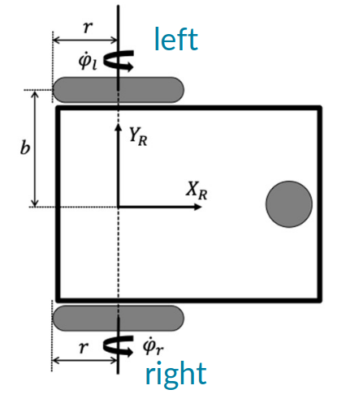
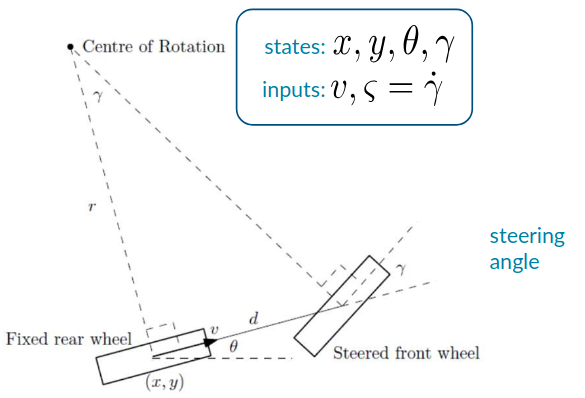

# Lecture 5, Jan 12, 2026

## Vehicle Models

{width=30%}

* Consider the unicycle model kinematics we derived previously for differential drive (note we redefine $b$ to be half the distance between wheels) $\cvec{v}{\omega} = \frac{1}{2}\mattwo{r}{r}{r/2b}{-r/2b}\cvec{\dot\varphi _r}{\dot\varphi _l}$
	* Define the inertial frame configuration $\bm q = \cvec{x}{y}{\theta}$
	* To handle the nonholonomic constraint, consider $\dot{\bm q}$ in the vehicle frame, since we are constrained to have $u = 0$
		* $\dot{\bm q} = \cvec{\dot x}{\dot y}{\dot\theta} = \matthree{\cos\theta}{-\sin\theta}{0}{\sin\theta}{\cos\theta}{0}{0}{0}{1}\cvec{v}{0}{\omega}$
	* The overall kinematics in inertial frame is $\dot{\bm q} = \matthreetwo{\cos\theta}{0}{\sin\theta}{0}{0}{1}\mattwo{r/2}{r/2}{r/2b}{r/2b}\cvec{\dot\varphi _r}{\dot\varphi _l} = \bm G(q)\bm p$
* Generally we can write the nonholonomic constraints in matrix form as $\bm H(q)^T\dot{\bm q} = 0$, so the admissible velocities consists of the null space of $\bm H(\bm q)^T$
	* Let the generalized velocity $\bm p$, then the null space of $\bm H(\bm q)^T$ is $\dot{\bm q} = \bm G(\bm q)\bm p$ where $\bm H(\bm q)^T\bm G(\bm q) = \bm 0$
	* For the unicycle model, $\bm G(\bm q) = \matthreetwo{\cos\theta}{0}{\sin\theta}{0}{0}{1}$
* To model the vehicle dynamics as well, we usually use Euler-Lagrange: $\diff{}{t}\left(\pdiff{^TL}{\dot{\bm q}}\right) - \pdiff{^TL}{\bm q} + \bm\tau + \bm H(\bm q)\bm\lambda$ where the $\bm H(\bm q)\bm\lambda$ models nonholonomic constraints, with $\bm\lambda$ being the Lagrange multipliers
	* The generalized forces can be expressed as $\bm\tau = \bm G(\bm q)\bm\nu$ so that the nonholonomic constraints are satisfied
* For the unicycle model:
	* $T = \frac{1}{2}m(\dot x^2 + \dot y^2) + \frac{1}{2}I\dot\theta^2, V = 0$
	* The Lagrange multiplier in this case represents the constraint forces arising from the vehicle kinematics (i.e. force from the wheel no-slip constraints), but we don't know this force so we try to eliminate it
	* $\diff{}{t}\left(\pdiff{^TL}{\dot{\bm q}}\right) = \cvec{m\ddot x}{m\ddot y}{I\ddot\theta}, \pdiff{^TL}{\bm q} = \bm 0, \bm\tau = \bm G(\bm q)\bm\nu$
	* To eliminate the unknown Lagrange multiplier, premultiply the EL equation by $\bm G(\bm q)^T$:
		* $\alignedimp[t]{\bm G(\bm q)^T\diff{}{t}\left(\pdiff{^TL}{\dot{\bm q}}\right) - \bm G(\bm q)^T\pdiff{^TL}{\bm q} = \bm G(\bm q)^T\bm\tau + \bm G(\bm q)^T\bm H(\bm q)\bm\lambda}{\mattwothree{\cos\theta}{\sin\theta}{0}{0}{0}{1}\cvec{m\ddot x}{m\ddot y}{I\ddot\theta} = \bm\nu}$
		* Note in this case $\bm G(q)^T\bm G(q) = \bm 1$, but this is not true in general
	* Recall the generalized velocity is $\bm p = \cvec{v}{\omega} \implies \dot{\bm p} = \cvec{\ddot x\cos\theta + \ddot y\sin\theta}{\ddot\theta}$
	* Therefore $\mattwo{m}{0}{0}{I}\cvec{\dot v}{\dot\omega} = \bm\nu \iff \bm M\dot{\bm p} = \bm\nu$
	* The complete model is $\cvec{\dot{\bm q}}{\dot{\bm p}} = \mattwo{\bm 0}{\bm G(\bm q)}{\bm 0}{-\bm M^{-1}\bm D}\cvec{\bm q}{\bm p} + \cvec{\bm 0}{\bm M^{-1}}\bm u$
		* This uses a damped model for forces $\bm\nu = -\bm D\bm p + \bm u$ where $\bm u = \cvec{f}{g}$, $f$ is some longitudinal thrust and $g$ is some steering torque

{width=45%}

* For the bicycle model:
	* Define state $\cvec{x}{y}{\theta}{\gamma}$, generalized velocity $\bm p = \cvec{v}{\varsigma}$ (where $\varsigma$ is the steering velocity)
	* Form the nonholonomic constraints by taking lateral slip constraints from the wheel model for both wheels, and find the nullspace of $\bm H(\bm q)^T$ to get $\cvec{\dot x}{\dot y}{\dot\theta}{\dot\gamma} = \mat{\mrow{\cos\theta}{0}\mrow{\sin\theta}{0}\mrow{\frac{\tan\gamma}{d}}{0}\mrow{0}{1}}\cvec{v}{\varsigma} \iff \dot{\bm q} = \bm G(\bm q)\bm p$
	* Form the Lagrangian: $\alignedeqntwo[t]{L}{\frac{1}{2}(m_r + m_f)(\dot x^2 + \dot y^2) + \frac{1}{2}(I_r + m_fd^2)\dot\theta^2 + \frac{1}{2}I_f(\dot\theta + \dot\gamma)^2}{\frac{1}{2}m(\dot x^2 + \dot y^2) + \frac{1}{2}I\dot\theta^2 + \frac{1}{2}I_f(\dot\theta + \dot\gamma)^2}$
		* Note this comes from the kinetic energy of the forward and rear wheels combined
	* Now we have $\diff{}{t}\left(\pdiff{^TL}{\dot{\bm q}}\right) = \cvec{m\ddot x}{m\ddot y}{I\ddot\theta + I_f(\ddot\theta + \ddot\gamma)}{I_f(\ddot\theta + \ddot\gamma)} = \bm M\ddot{\bm q}, \pdiff{^TL}{\bm q} = \bm 0, \bm\tau = \mat{\mrow{\cos\theta}{0}\mrow{\sin\theta}{0}\mrow{0}{0}\mrow{0}{1}}\bm\nu = \bm F(\bm q)\bm\nu$
		* $\bm M = \matfour{m}{0}{0}{0}{0}{m}{0}{0}{0}{0}{I + I_f}{I_f}{0}{0}{I_f}{I_f}$
		* Note $\bm\tau$ is somewhat arbitrary here; the matrix $\bm F(\bm q)$ is not necessarily related to $\bm G(\bm q)$, and instead is just based on what we choose
	* Premultiply by $\bm G(\bm q)^T$ to eliminate the Lagrange multiplier again to get $\dot{\bm p} = \bm M(\bm q)^{-1}(-(\bm G(q)^T\bm M\dot{\bm G}(\bm q) + \bm D)\bm p + \bm u) = \bm M(\bm q)^{-1}(-\bm D(\bm q, \bm p)\bm p + \bm u)$
		* Note $\bm M(\bm q) = \bm G(\bm q)^T\bm M\bm G(\bm q)$
		* We again used damped forces $\bm\nu = -\bm D\bm p + \bm u$
	* Complete system model: $\cvec{\dot{\bm q}}{\dot{\bm p}} = \mattwo{\bm 0}{\bm G(\bm q)}{\bm 0}{-\bm M(\bm q)^{-1}\bm D(\bm q, \bm p)}\cvec{\bm q}{\bm p} + \cvec{\bm 0}{\bm M(\bm q)^{-1}}\bm u$ In general all vehicle models can be written as a nonlinear differential equation $\dot{\bm x} = \bm A(\bm x)\bm x + \bm B(\bm x)\bm u$ where $\bm x = \cvec{\bm q}{\bm p}$ consisting of the configuration (pose, etc) and generalized velocity
	* If we ignore dynamics, then $\bm A = 0$
* Additional constraints can be added to the model to limit $\set{\bm x, \bm u}$ to an allowed set $S_\text{allowed}$, e.g. turning rates or obstacles
	* These constraints are in general non-convex and makes optimization much harder
* Example: imposing a curvature constraint on the unicycle model
	* Define the curvature $k = \frac{\omega}{v} = \frac{1}{b}\frac{\dot\varphi _r - \dot\varphi _l}{\dot\varphi _r + \dot\varphi _l}$ and radius of curvature $R = \frac{1}{\abs{k}}$
	* A max curvature constraint would impose $\abs{\frac{\omega}{v}} = \abs{k} \leq k_\text{max} = \frac{1}{R_\text{min}}$

