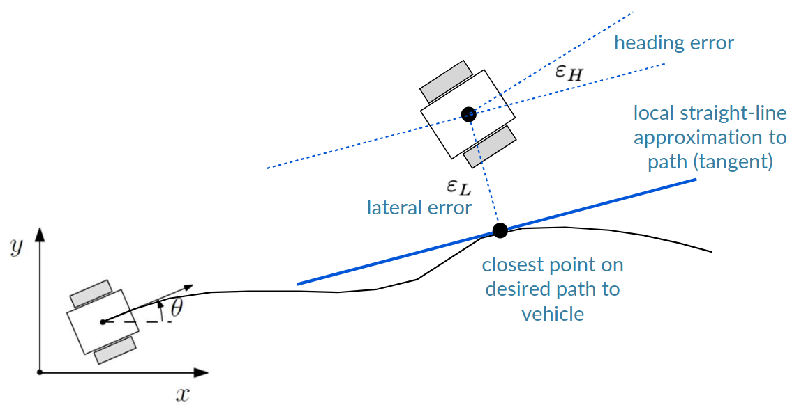
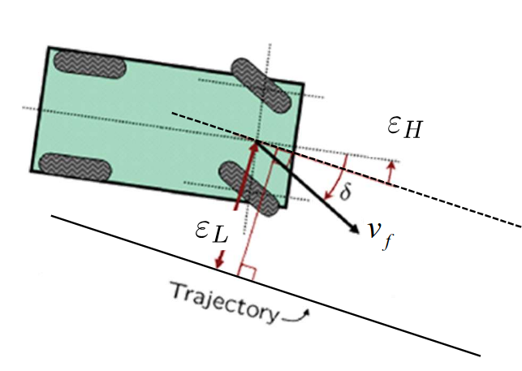

# Lecture 6, Jan 14, 2026

## Path-Tracking Control

* Given a reference path $\bm x_d$, we want to design controllers which output a vehicle command $\bm u$ input to the robot, which results in the actual state $\bm x$ subject to a disturbance $\bm w$; we measure the state with sensors which produce readings $\bm y$, corrupted by noise $\bm n$, and a state estimator produces the estimate $\hat{\bm x}$ used in the controller
	* For now we take sensing and state estimation for granted, i.e. $\hat{\bm x} = \bm x$
* This problem is complicated by the fact that our vehicle models are usually nonlinear (e.g. differential drive) and are working with a MIMO system
* Note that *trajectory control* involves commanding the robot to a specific state at a specific time, while *path-tracking control* cares only about how the robot gets to the state and not the time
	* Trajectory control is more useful for e.g. synchronized drone swarms
	* When trajectory control falls behind it needs to cut corners to catch up, which is bad since it might hit hazards in the way

{width=70%}

* The path can be approximated as locally straight, allowing us to define a *crosstrack error* $\varepsilon _L = y_d - y$ (i.e. lateral deviation) and a heading error $\varepsilon _H = \theta _d - \theta$ for the robot, which we assume can be measured (e.g. through odometry)
	* We define $x$ to point along the path and $y$ perpendicular to it

### Feedback Linearization

* The first approach is *feedback linearization*, where we design a controller to cancel out the nonlinear dynamics, which is only possible if we know the dynamics of the system exactly
	* Assuming the motion is of the form $\dot x = f(x) + g(x)u$, we want to find an input mapping which maps a new input $\eta$ to $u$, so that the overall plant with $\eta$ as an input is linear
	* We want to find $u = a(x) + b(x)\eta$ such that $\dot x = f(x) + g(x)(a(x) + b(x)\eta) = Ax + B\eta$, i.e. find $A$ and $B$ such that $f(x) + g(x)a(x) = Ax, g(x)b(x)\eta = B\eta$
	* This can be difficult and might not be possible for some systems
* Applied to the path tracking controller using the unicycle model $\dot{\bm q} = \cvec{\dot x}{\dot y}{\dot\theta} = \matthreetwo{\cos\theta}{0}{\sin\theta}{0}{0}{1}\cvec{v}{\omega}$
	* Assuming a constant velocity, $\cvec{\dot\varepsilon _L}{\dot\varepsilon _H} = \cvec{v\sin\varepsilon _H}{\omega}$
		* Note that $y_d, \theta _d = 0$ since we are working in the path frame, so the desired heading and lateral position are always zero
		* This can be interpreted as an implicit assumption that we're following a straight path (since the path is approximated as straight based on the closest point)
	* Apply a change of variables $\cvec{z_1}{z_2} = \cvec{\varepsilon _l}{v\sin\varepsilon _H}$, computing the new derivatives gives us the vehicle model $\cvec{\dot z_1}{\dot z_2} = \mattwo{0}{1}{0}{0}\cvec{z_1}{z_2} + \cvec{0}{1}\eta$ where $\eta = v\omega\cos\varepsilon _H$, which is now linear
		* Note when performing the change of variables we need to ensure that the new variables go to zero when the original path errors go to zero
	* If we add an output $y = \rvec{\alpha}{1}\cvec{z_1}{z_2}$, we now have a SISO system which we can design a controller for using classical methods; we can pick $\alpha$ as the relative importance of the heading and crosstrack errors
		* This has transfer function $\frac{s + \alpha}{s^2}$ (which we converted from state-space form)
		* The overall closed-loop transfer function is $\frac{y(s)}{y_d(s)} = \frac{P(s)C(s)}{1 + P(s)C(s)}$ where $C(s)$ is the controller transfer function, $P(s)$ is the plant transfer function
		* Using a simple proportional controller, $C(s) = K, \eta = Ke(t)$, giving us poles at $1 + P(s)C(s) = \frac{s^2 + Ks + \alpha K}{s^2} = 0$
		* To get e.g. two identical negative real poles, we can choose $K = 4\alpha$, which results in poles at $-2\alpha$
	* The final controller has 2 tuning parameters, $\alpha$ and the constant speed $v$
	* To actually implement the controller, we need to compute $z_1, z_2$ from the errors, then $y$, then $\eta$ according to our controller, and finally back to $\omega$
	* When we make all substitutions, we get $\alignedeqntwo[t]{\omega}{\frac{1}{v\cos\varepsilon _H}\eta}{\frac{1}{v\cos\varepsilon _H}K(y_d - y)}{-\frac{1}{v\cos\varepsilon _H}4\alpha(\alpha z_1 + z_2)}{-\frac{1}{v\cos\varepsilon _H}4\alpha(\alpha\varepsilon _L + v\sin\varepsilon H)}{-\frac{4\alpha^2}{v}\frac{\varepsilon _L}{\cos\varepsilon _H} - 4\alpha\tan\varepsilon _H}$
		* This reveals that we need to ensure $v \neq 0$ and $\cos\varepsilon _H \neq 0$, which means that the controller cannot deal with pure rotations or 90 degree heading errors
		* The singularity also means that if we start with a heading error greater than 90 degrees, we can never recover
* Another issue with this controller is that it reacts to only the current lateral heading errors (since it only looks at the errors at the closest point on the path), so it has no way of looking forwards to correct for future errors
	* This results in overshoots at every turn
	* This can be partially addressed by considering path curvature or computing the error based on a point ahead of the vehicle

\noteImportant{In general, feedback linearization can hide singularities inside the change of variables as we've seen in the unicycle model example, which we need to watch out for.}

### Geometric Path Following Control

* For specific vehicle kinematic models, we can come up with specialized controllers for path control, e.g. the *pure pursuit* controller for unicycle and bicycle models, which simply chases a point at a fixed distance ahead along the desired path
* The *Stanley controller* for bicycle models can drive heading and crosstrack errors to zero without singularities (i.e. global convergence)

{width=50%}

* For the Stanley controller, we calculate the tracking errors relative to the centre point of the front axle, which is more stable (as opposed to the kinematic centre at the rear axle)
* We have two inputs, steering rate $\delta$ and vehicle velocity $v_f$ in the direction of front wheels
	* The heading error is computed about the instantaneous centre of rotation, which is defined by the steering angle $\delta$
	* $\dot\varepsilon _H(t) = \frac{-v_f(t)\sin(\delta(t))}{l}$
	* $\dot\varepsilon _L(t) = v_f(t)\sin(\varepsilon _H(t) - \delta(t))$
* The Stanley controller combines 3 requirements for steering for the combined law $\delta(t) = \varepsilon _H(t) + \tan^{-1}\left(\frac{k\varepsilon _L(t)}{v_f(t)}\right)$
	* Steer to align heading with desired heading, proportional to heading error: $\delta(t) = \varepsilon _H(t)$
	* Steer to eliminate crosstrack error, inversely proportional to speed and soft-capped with inverse tangent: $\delta(t) = \tan^{-1}\left(\frac{k\varepsilon _L(t)}{v_f(t)}\right)$
	* Keep steering angle between a maximum and minimum $\delta(T) \in [\delta _\text{min}, \delta _\text{max}]$
* The error dynamics can be derived as $\dot\varepsilon _L(t) = \frac{-k\varepsilon _L(t)}{\sqrt{1 + \left(\frac{k\varepsilon _L(t)}{v_f}\right)^2}}$
	* Notice that when the crosstrack error is small, this approximately results in exponential decay
* In practice, there are several improvements we can make:
	* Add a softening constant $k_s$ to $v_f(t)$ to prevent aggressive steering when the vehicle is moving slowly
	* Extra damping can be applied to the heading term helps counteract effect of noise at higher speeds
	* We can also steer into constant radius curves using a feedforward term (i.e. have a term to steer to a specific angle if we know we're following a known curvature)

### Model Predictive control

* Model predictive control (MPC) uses the full nonlinear model of the plant and a parametrized controller to predict the errors within a future window (the horizon)
	* At each step, we predict all future errors for some horizon, and find the optimal control input within the horizon that minimizes this error, then we apply only first step (or a short time), and iterate again
		* Hence MPC is also known as *receding horizon control* since we have this time horizon that keeps moving
	* The optimization is usually numerical, and minimizes a weighted sum of squared errors, with current errors often weighted higher than future errors
* In this case, the "controller" we're parametrizing is a series of control inputs $v(t), \omega(t)$
	* A simple version is the cubic polynomial: $\cvec{v(t)}{\omega(t)} = \cvec{v_0}{\omega _0} + \cvec{v_1}{\omega _1}t + \cvec{v_2}{\omega _2}t^2 + \cvec{v_3}{\omega _3}t^3$
	* This gives $\bm u = (v_0, \omega _0, v_1, \omega _1, v_2, \omega _2, v_3, \omega _3)$
* The full nonlinear model is used to forward simulate the system according to the sequence of inputs, which allows us to calculate the lateral error
* We can define a cost function $J(\bm u) = \frac{1}{2}\sum _i w_i\varepsilon _{L,i}^2 + \frac{1}{2}\sum _k \left(w_{v,k}v_k^2 + w_{\omega,k}\omega _k^2\right)$
	* The first term is the path tracking cost; we can choose the weights $w_i$ to weigh current errors more than future ones
	* The second term acts like regularization which penalizes large control inputs (ridge regression)
* This can be solved for the optimal control inputs $\bm u^* = \argmin _{\bm u} J(\bm u)$, which we apply for a short time and rerun the optimization

