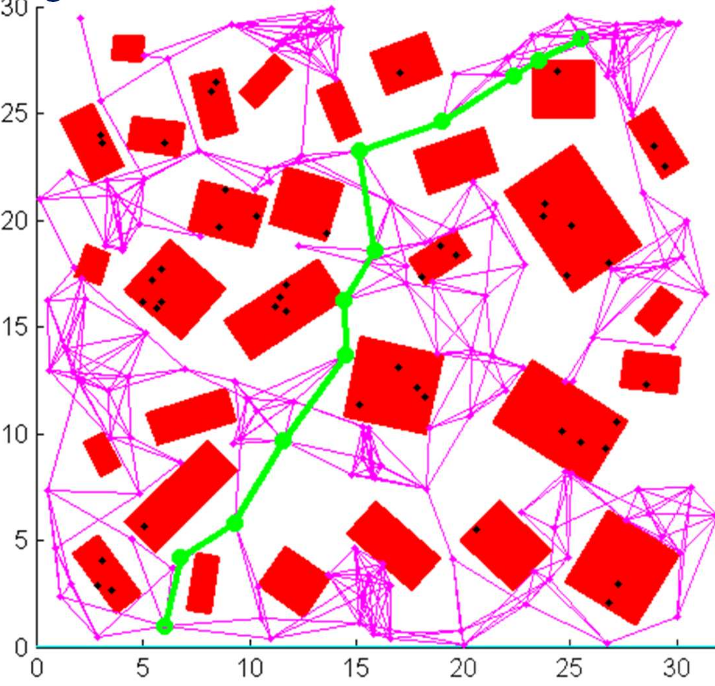
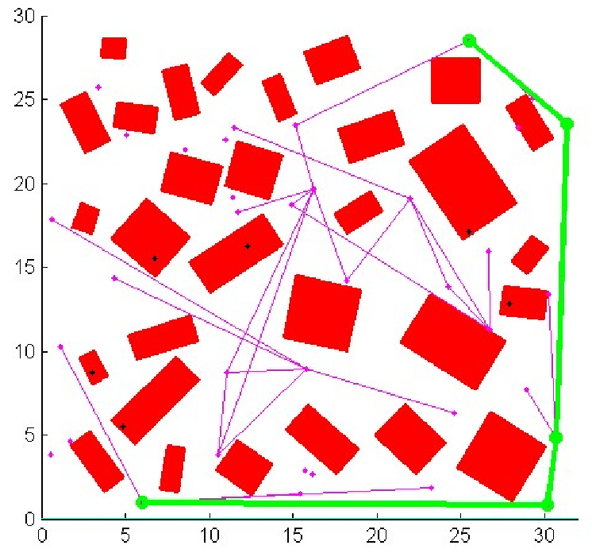
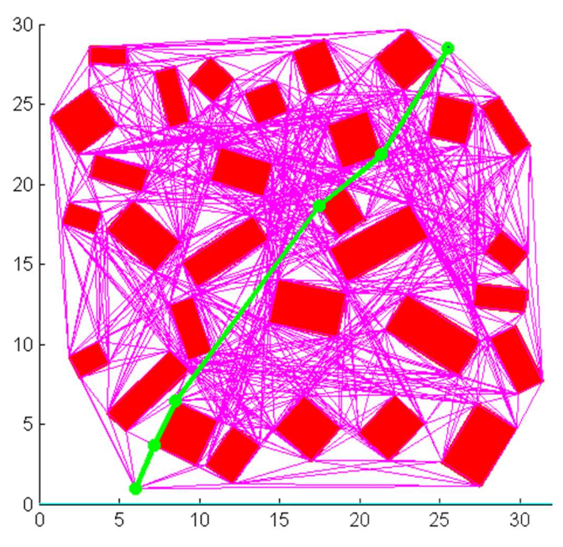

# Lecture 9, Jan 21, 2026

## Sampling-Based Planning -- Probabilistic Roadmaps (PRMs)

* Consider the problem of planning a path in configuration space, where some states are free and some others are forbidden; we have the ability to sample some states to do a collision check, but it would be too expensive to check every single state
* We can randomly sample a large number of points and check each one for collisions, discarding the forbidden states
	* The remaining states are the known as the *milestones*
* For each milestone, try to link it to its nearest neighbours using a straight line path, and check each path for collisions, keeping the collision-free ones
	* Since the path is continuous, we will need some kind of approximation
	* The remaining edges are retained as the *local paths*
* *Multi-query roadmaps* build the PRM once, and reuse it for answering queries; *single-query roadmaps* compute the PRM from scratch for each new query, which is useful for dynamic environments
* More precisely, given starting state $s$ and goal state $g$, configuration space $C$ and free space $F \subseteq C$:
	1. Initialize PRM $R$ with nodes $s, g$
	2. Repeat until $s$ and $g$ are in the same connected component of $R$, or after a maximum of $N$ iterations:
		1. Sample a configuration $q$ from the configuration space $C$ with probability $p$
		2. If $q \in F$ then add it as a new milestone of $R$
		3. For each milestone $v \in R$ such that $v \neq q$, if path $(q, v) \in F$, then add it as a new edge of $R$
			* Note here we can apply any technique we want to select $v$, and control the number of nearest neighbours that we consider
	3. If $s$ and $g$ are connected, return a path between them, otherwise return no path

{width=50%}

* Checking sampled configurations and connections between them for collisions is the most important part of the algorithm, which can be done with *hierarchical collision detection*
* Instead of sampling randomly, we can apply non-uniform sampling strategies to select more informative states, so we can capture the connectivity of free space with relatively few nodes and local paths
	* PRM is bottlenecked by the ability to find milestones in narrow passages and connect them to the rest of the graph
* The *visibility set* of a configuration $q$ is $V(q) = \set{q' | (q, q') \in F}$, i.e. the set of all configurations that can be connected to $q$ by a straight line edge
	* Intuitively, the larger the visibility set of a configuration, the more of free space it captures
	* The size of $V(q)$ is the *expansiveness* of the configuration $q$
	* We can sum the expansiveness of all the configurations in $C$ to get a sense of the expansiveness of the entire configuration space
		* High expansiveness environments are generally open, with wide passages
		* Spaces with narrow passages, especially non-straight passages, have low expansiveness
		* A convex set (i.e. a set in which we can connect every point with every other point) is maximally expansive
* In practice, most planning problems result in relatively expansive configuration spaces even with complex constraints, so PRM tends to work pretty well
* It's possible to prove that with probability converging exponentially in the number of milestones, a feasible path will be found, if one exists
	* This means PRM is probabilistically complete, and we can also find paths relatively quickly due to the exponential convergence
* We can do this in a batched manner where we first find a set of milestones, then the edges, and then search the graph hoping for connectivity, or we can do it in an online manner, adding one milestone and paths each time and doing a search to check for connectivity
	* The online search can lead to faster convergence, but sacrifices optimality
	* We can mix these two approaches for a balance between anytime convergence and optimality

{width=50%}

* In 2D spaces, we can obtain the true optimal path by using a *visibility graph*, where each vertex on each obstacle is a milestone and connected to every other possible vertex
	* However this only works in 2D and without any motion constraints, so it's not very useful in practice
	* This also takes a very long time to build the graph, so PRM may still be preferable since it can generate a non-optimal path in shorter time

{width=50%}

