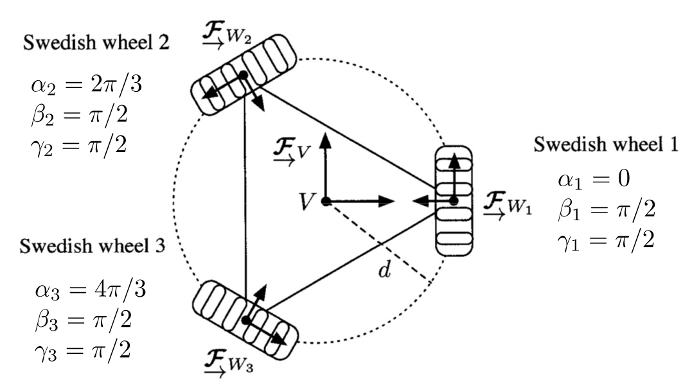

# Tutorial 2, Jan 14, 2026

## 3-Wheel Omnidirectional Robot Example

{width=80%}

* Consider a 3-wheeled omnidirectional robot, with wheels arranged in the diagram and rollers arranged so that the wheel can roll laterally
* Recall the set of Swedish wheel constraints:
	* $\rvec{\cos(\alpha + \beta + \gamma)}{\sin(\alpha + \beta + \gamma)}{d\sin(\beta + \gamma)}\dot{\bm\xi} = \dot\varphi r\cos\gamma + \dot\varphi _sr_s$
	* $\rvec{-\sin(\alpha + \beta + \gamma)}{\cos(\alpha + \beta + \gamma)}{d\cos(\beta + \gamma)}\dot{\bm \xi} = -\dot\varphi r\sin\gamma$
* Substituting $\gamma = \pi/2$ for all 3 wheels, and ignoring the first constraint since the rollers are free:
	* $\alignedimp[t]{\matthree{\cos\pi/2}{\sin\pi/2}{d\sin\pi/2}{\cos7\pi/6}{\sin7\pi/6}{d\sin\pi/2}{\cos11\pi/6}{\sin11\pi/6}{d\sin\pi/2}\dot{\bm \xi} = r\cvec{\dot\varphi _1}{\dot\varphi _2}{\dot\varphi _3}}{\matthree{0}{1}{d}{-\sqrt{3}/2}{-1/2}{d}{\sqrt 3/2}{-1/2}{d}\cvec{v}{u}{\omega} = r\cvec{\dot\varphi _1}{\dot\varphi _2}{\dot\varphi _3}}$
* This gives the inverse differential kinematics: $\cvec{\dot\varphi _1}{\dot\varphi _2}{\dot\varphi _3} = \frac{1}{r}\matthree{0}{1}{d}{-\sqrt{3}/2}{-1/2}{d}{\sqrt 3/2}{-1/2}{d}\cvec{v}{u}{\omega} = \bm A\dot{\bm\xi}$
* To get the forward kinematics we multiply by $\bm A^{-1}$ to get $\cvec{v}{u}{\omega} = r\matthree{0}{-1/\sqrt 3}{1/\sqrt 3}{2/3}{-1/3}{-1/3}{1/(3d)}{1/(3d)}{1/(3d)}\cvec{\dot\varphi _1}{\dot\varphi _2}{\dot\varphi _3}$
* What if we switch the first wheel to a standard wheel?
	* We need to add the standard wheel lateral constraint $\rvec{-\sin\pi/2}{\cos\pi/2}{d\cos\pi/2}\dot{\bm\xi} = 0$
	* This results in the new kinematics $\mat{\mrow{0}{1}{d}\mrow{-\sqrt 3/2}{-1/2}{d}\mrow{\sqrt 3/2}{-1/2}{d}\mrow{-1}{0}{0}}\cvec{v}{u}{\omega} = r\cvec{\dot\varphi _1}{\dot\varphi _2}{\dot\varphi _3}{0}$
	* Notice now that we are forcing $v$ to be zero, but we can still freely control $u$ and $\omega$
	* We can also simply the model down to completely eliminate $v$ now since the vehicle only have 2 degrees of freedom

