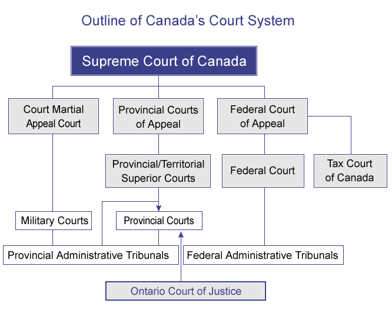

# Lecture 3, Jan 19, 2026

## Introduction to Common Law

* Common law comes from judges' written decisions in trials, or decisions of appellant courts, SCC, or from administrative tribunals
* There are several levels of courts in Canada:
	* The supreme court is the court of final appeal
	* Federal courts hear matters that involve the federal government (e.g. taxes, immigration, IP, etc)
		* This is divided into a trial division and a court of appeal
	* Military courts handle military matters
	* Provincial courts are the ones that deal with most issues
		* The superior courts can hear anything in the province
		* Appeal courts are above the superior courts
		* Judges are appealed federally, but paid for provincially and court is run by the province
* Lower courts are bound by precedent of higher-level courts
	* All courts are bound by the SCC
	* Provincially, every court is bound by the Courts of Appeal of that province
	* Decisions from other provinces can be influential but not binding
* When considering relevant precedent, it's important to note:
	* Older case law may be come less applicable (or be entirely rejected) since the law and societal values change over time
	* Cases currently under appeal are unreliable
	* All relevant cases must be considered, from all views
	* Facts are extremely important for applicability; a small change in facts can lead to totally different decisions
		* However principles can still be derived from different types of cases

{width=60%}

* Facts are introduced via evidence -- documents and testimony that courts accept
	* Evidence law is concerned with what kind of evidence can be submitted as reliable, i.e. what is admissible evidence
	* Evidence law may come from statue (Evidence Act in Ontario, Canada Evidence Act) or common law and cases
* *Admissibility* is whether evidence can be admitted; *weight* is how reliable a court determines the evidence to be, based on its truthfulness and accuracy, and therefore how much it influences a case
* Evidence can come from a number of sources:
	* Witness testimony
		* Credibility (how believable the person is, whether they are likely to lie) and reliability (how well they can actually perceive the events) are both important
		* Testimony must be about facts, not opinion or hearsay (i.e. information received from other people, deemed unreliable as they are not under oath)
	* Real evidence (physical things, such as paper documents, photographs, film, audio recordings, etc)
	* Documentary evidence (emails, letters, contracts, etc)
	* Opinion/Expert evidence
		* Experts such as engineers and doctors can present unbiased opinions drawn from facts, unlike normal witnesses which are limited to only facts
		* Opinions can only be given about the expert's area of expertise
		* Expert opinion is used to assist and educate courts in understanding complex areas beyond their normal experience

### Civil and Criminal Law
	
* Frequent areas of civil disputes involving professionals include:
	* Contracts
	* Tort (e.g. negligence)
	* Labour/employment
	* Property (including IP)
* Difference between civil and criminal law:
	* In criminal law, the state (crown) prosecutes a person (defendant) based upon infraction of statutory law (mostly the Criminal Code but also e.g. traffic codes), and if successful the defendant is fined or imprisoned
		* Important, criminal law does not compensate the victim, it only deters the crime
		* The standard of proof must be beyond a reasonable doubt, i.e. almost absolute certainty that the crime was committed
		* One of 3 types:
			* Conviction offences: usually smaller offences that result in fines and no jail time, e.g. minor theft and traffic violations
			* Indictable offences: serious offences often resulting in jail time, e.g. murder
			* Hybrid offences: can be either depending on judgement, e.g. assault, illegally carrying a weapon
	* In civil law, a person (plaintiff) makes a claim against another person (defendant) due to some damage they have caused, and if successful the defendant must compensate for the breach, usually by paying money
		* The plaintiff brings forward a Statement of Claim, while the defendant brings forward a Statement of Defence
			* The parties go through a discovery process to establish the facts (different from criminal law)
			* Resolution can happen at any time through a settlement
		* The standard of proof is based on a balance of probability -- the claim is successful as long as the proof is more likely to be true than false
		* Due to the difference in standard of proof, it's possible for the same case to succeed in civil court, but not criminal court
		* The parties bear the cost, and often the losing party has to pay in the settlement
			* The cost of litigation is an important factor to consider since civil court is all about money in the end
* In the case of criminal negligence, there will often be criminal and civil suits brought forward, and PEO investigations; usually the criminal trial takes priority

### Corporate Structures

* The law only applies to "persons" -- individuals or corporations; all "persons" can sue or be sued
* Corporations are one type of business association, but there are also different forms:
	* Sole proprietorship: a single person owns the business
		* The owner has unlimited liability, including for employees
		* Taxed like an individual
	* Partnership: multiple people share the ownership/operation/profits of the business
		* The Partnerships Act in Ontario sets out rules for partnerships that do not have explicit partnership agreements put in writing
			* By default the profits are evenly divided and each partner has the same authority
		* Partners have a duty to trust and not work against each other (fiduciary duty), which cannot be removed in a partnership agreement
		* Limited liability partnerships (e.g. lawyers and doctors) have the liability of a partner being limited to their proportionate share, but in general the liability is unlimited by default
			* There is required to be a general partner who has limited liability
		* Partners are taxed based on the funds they receive, as individuals
	* Corporation: formed under the laws of the provincial/federal government
		* The corporation as a whole absorbs all the liabilities of the people who work for it -- it acts as a barrier to individuals being found individually liable
		* They have the power to sue and be sued as they constitute persons; in cases they are indicated with suffixes like Corp, Inc, or Ltd
		* Corporations have to be federally or provincially registered with a name, which comes with filing and accounting requirements, making it more expensive
		* Corporations can be publicly or privately held
		* Officers and directors are fiduciaries and must act in the best interest of the corporation
			* They may face civil and criminal liabilities for acting outside the duties of the corporation
* Sole proprietors and partnerships are not persons, but corporations are
	* When suing or being sued, the person behind the sole proprietorship/partnership is suing or being sued

